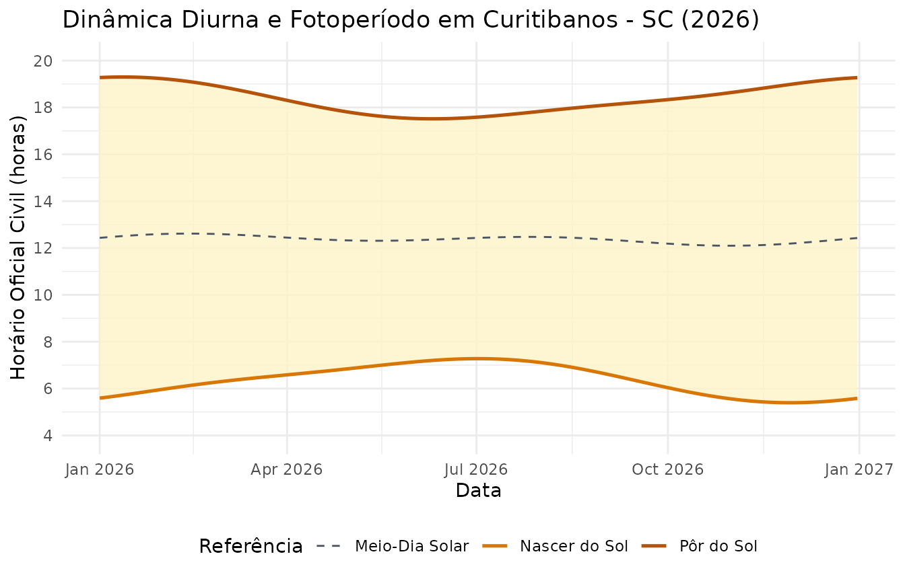

# Geometria Solar e Fotoperíodo com agriclimr

## Introdução

O pacote **agriclimr** disponibiliza um módulo dedicado à geometria
astronômica diurna por meio das funções:

- [`estimate_solar_noon()`](https://joaobtj.github.io/agriclimr/reference/estimate_solar_noon.md):
  Meio-dia solar (em hora solar local ou hora civil corrigida).
- [`estimate_sunrise()`](https://joaobtj.github.io/agriclimr/reference/estimate_sunrise.md):
  Horário do nascer do sol.
- [`estimate_sunset()`](https://joaobtj.github.io/agriclimr/reference/estimate_sunset.md):
  Horário do pôr do sol.
- [`estimate_daylength()`](https://joaobtj.github.io/agriclimr/reference/estimate_daylength.md):
  Fotoperíodo ou duração astronômica do dia.

``` r

library(agriclimr)
library(ggplot2)
library(dplyr)
```

------------------------------------------------------------------------

## 1. Fundamentos Teóricos

A posição angular do sol varia ao longo do ano em função da declinação
solar ($`\delta`$). O pacote utiliza a aproximação trigonométrica
descrita por Campbell & Norman (1998) e adotada no boletim FAO 56:

``` math
\delta = 0{,}409 \cdot \sin\left(\frac{2\pi}{365} \cdot DOY - 1{,}39\right)
```

Onde $`DOY`$ é o dia juliano do ano (1 a 365/366). A partir da latitude
local ($`\phi`$, em radianos) e da declinação, calcula-se o ângulo
horário do pôr do sol ($`\omega_s`$):

``` math
\cos(\omega_s) = -\tan(\phi) \cdot \tan(\delta)
```

Com $`\omega_s`$ expresso em radianos, o fotoperíodo astronômico
($`DL`$, em horas decimais) é obtido diretamente por:

``` math
DL = \frac{24}{\pi} \cdot \omega_s
```

------------------------------------------------------------------------

## 2. Exemplos de Uso Básico

### Fotoperíodo e Horários Solares em Curitibanos - SC

Considere o município de Curitibanos, Santa Catarina (Latitude:
$`-27{,}28^\circ`$, Longitude: $`-50{,}58^\circ`$, Fuso: UTC-3).

Podemos comparar os solstícios de inverno (dia 172) e de verão (dia
355):

``` r

lat_curitibanos <- -27.28
doy_inverno <- 172
doy_verao   <- 355

# Fotoperíodo (horas de luz solar)
dl_inverno <- estimate_daylength(lat = lat_curitibanos, doy = doy_inverno)
dl_verao   <- estimate_daylength(lat = lat_curitibanos, doy = doy_verao)

cat("Fotoperíodo no Inverno:", round(dl_inverno, 2), "horas\n")
#> Fotoperíodo no Inverno: 10.28 horas
cat("Fotoperíodo no Verão:  ", round(dl_verao, 2), "horas\n")
#> Fotoperíodo no Verão:   13.72 horas
```

------------------------------------------------------------------------

## 3. Hora Solar Local vs. Hora Civil do Relógio

Por padrão, modelos teóricos assumem o **meio-dia solar estático às
12:00 h**. No entanto, quando comparamos modelos com dados de estações
meteorológicas automáticas, o descompasso entre a hora do meridiano
civil e a hora solar real pode alcançar dezenas de minutos.

Ao informar `lon` e `tz`, a função
[`estimate_solar_noon()`](https://joaobtj.github.io/agriclimr/reference/estimate_solar_noon.md)
aplica a Equação do Tempo (Spencer, 1971) e o ajuste longitudinal:

``` r

# Meio-dia solar padrão (12:00)
noon_solar <- estimate_solar_noon(doy = doy_inverno)

# Meio-dia na hora civil oficial da estação (UTC-3)
noon_civil <- estimate_solar_noon(
  doy = doy_inverno, 
  lon = -50.58, 
  tz = -3
)

cat("Meio-dia Solar Local: ", noon_solar, "h\n")
#> Meio-dia Solar Local:  12 h
cat("Meio-dia na Hora Civil:", format(as.POSIXct("1970-01-01") + noon_civil * 3600, "%H:%M:%S"), "\n")
#> Meio-dia na Hora Civil: 12:23:46

# Impacto direto no horário do nascer do sol
sunrise_civil <- estimate_sunrise(lat = lat_curitibanos, doy = doy_inverno, solar_noon = noon_civil)
cat("Nascer do sol civil:   ", format(as.POSIXct("1970-01-01") + sunrise_civil * 3600, "%H:%M:%S"), "\n")
#> Nascer do sol civil:    07:15:25
```

------------------------------------------------------------------------

## 4. Comportamento Anual da Dinâmica Solar

As funções do pacote são totalmente vetorizadas, permitindo avaliar a
variação de fotoperíodo e dos horários solares ao longo de todo o ano em
um único passo:

``` r

# Criando a série anual de dias
df_ano <- tibble::tibble(
  date = seq(as.Date("2026-01-01"), as.Date("2026-12-31"), by = "day"),
  doy = as.numeric(format(date, "%j"))
) %>%
  dplyr::mutate(
    solar_noon = estimate_solar_noon(doy, lon = -50.58, tz = -3),
    sunrise = estimate_sunrise(lat = lat_curitibanos, doy = doy, solar_noon = solar_noon),
    sunset = estimate_sunset(lat = lat_curitibanos, doy = doy, solar_noon = solar_noon),
    daylength = estimate_daylength(lat = lat_curitibanos, doy = doy)
  )

head(df_ano)
#> # A tibble: 6 × 6
#>   date         doy solar_noon sunrise sunset daylength
#>   <date>     <dbl>      <dbl>   <dbl>  <dbl>     <dbl>
#> 1 2026-01-01     1       12.4    5.59   19.3      13.7
#> 2 2026-01-02     2       12.4    5.60   19.3      13.7
#> 3 2026-01-03     3       12.4    5.61   19.3      13.7
#> 4 2026-01-04     4       12.5    5.62   19.3      13.7
#> 5 2026-01-05     5       12.5    5.64   19.3      13.7
#> 6 2026-01-06     6       12.5    5.65   19.3      13.6
```

Podemos visualizar a janela diurna ao longo dos meses:

``` r

ggplot(df_ano, aes(x = date)) +
  geom_ribbon(aes(ymin = sunrise, ymax = sunset), fill = "#fef3c7", alpha = 0.8) +
  geom_line(aes(y = sunrise, color = "Nascer do Sol"), linewidth = 0.9) +
  geom_line(aes(y = sunset, color = "Pôr do Sol"), linewidth = 0.9) +
  geom_line(aes(y = solar_noon, color = "Meio-Dia Solar"), linetype = "dashed") +
  scale_y_continuous(breaks = seq(4, 20, by = 2), limits = c(4, 20)) +
  scale_color_manual(values = c("Nascer do Sol" = "#d97706", "Pôr do Sol" = "#b45309", "Meio-Dia Solar" = "#4b5563")) +
  labs(
    title = "Dinâmica Diurna e Fotoperíodo em Curitibanos - SC (2026)",
    x = "Data",
    y = "Horário Oficial Civil (horas)",
    color = "Referência"
  ) +
  theme_minimal() +
  theme(legend.position = "bottom")
```



------------------------------------------------------------------------

## 5. Integração com a Marcha Diurna de Temperatura

O módulo solar atua de forma transparente na reconstrução horária de
temperatura
([`estimate_hourly_temp()`](https://joaobtj.github.io/agriclimr/reference/estimate_hourly_temp.md)
e
[`daily_to_hourly_temp()`](https://joaobtj.github.io/agriclimr/reference/daily_to_hourly_temp.md)).
Ao fornecer longitude e fuso horário, a curva diurna ajusta seu pico e
vale ao horário real de relógio das estações meteorológicas, aprimorando
simulações de orvalho e dessecação foliar.

------------------------------------------------------------------------

## Referências

- Campbell, G. S., & Norman, J. M. (1998). *An Introduction to
  Environmental Biophysics*. Springer, New York.
- Spencer, J. W. (1971). Fourier series representation of the position
  of the Sun. *Search*, 2(5), 172.
- Allen, R. G., Pereira, L. S., Raes, D., & Smith, M. (1998). *Crop
  evapotranspiration: Guidelines for computing crop water requirements*.
  FAO Irrigation and Drainage Paper 56. FAO, Rome.
